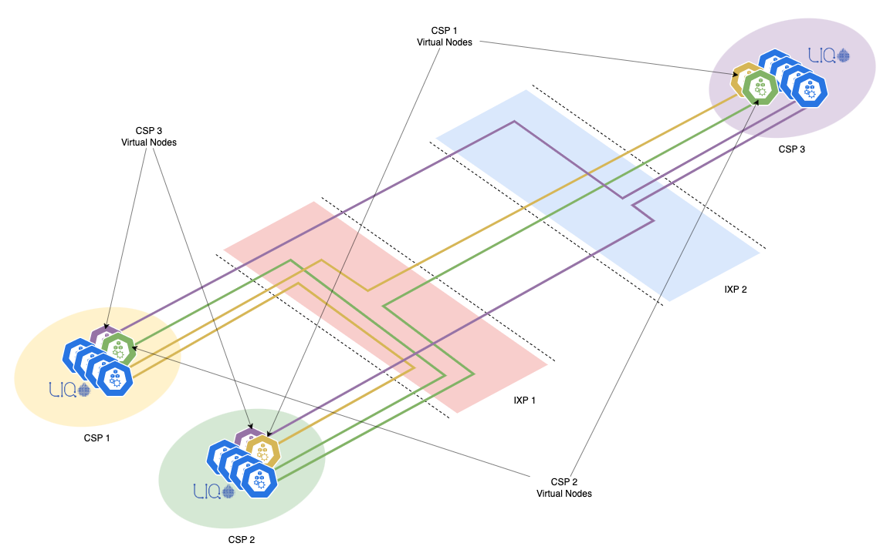
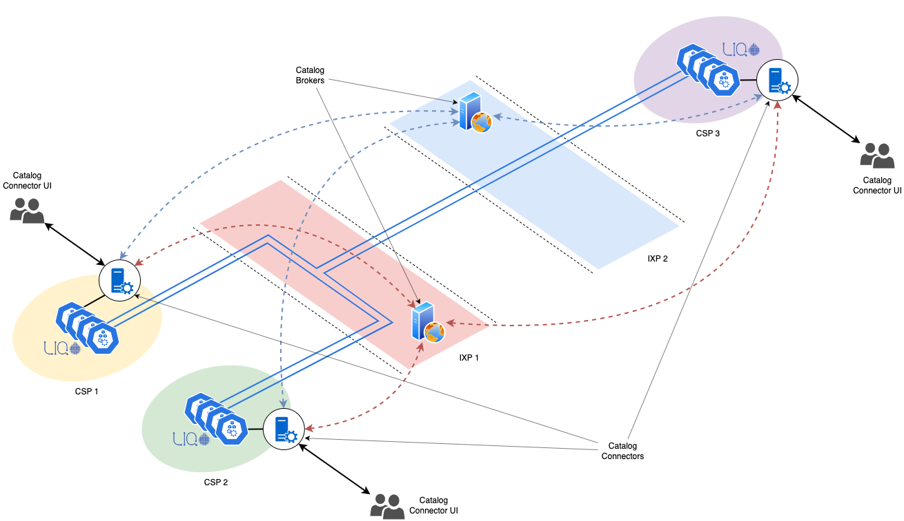

<!-- omit in toc -->
# The Catalog
a Liqo based application to discover and advertise k8s resources between different and heterogeneous clusters

<!-- omit in toc -->
- [What is the Catalog?](#what-is-the-catalog)
- [Architecture](#architecture)
  - [The Distributed Catalog](#the-distributed-catalog)
  - [Models and Objects](#models-and-objects)
  - [Workflows](#workflows)
    - [Discovery](#discovery)
    - [Advertisement](#advertisement)
    - [Negotiation](#negotiation)
    - [Peering](#peering)
  - [Technologies and Frameworks](#technologies-and-frameworks)
    - [Broker](#broker)
    - [Connector](#connector)
    - [Connector UI](#connector-ui)
- [Catalog API](#catalog-api)
  - [Broker API](#broker-api)
  - [Connector API](#connector-api)
- [Getting Started](#getting-started)
  - [Prerequisites](#prerequisites)
  - [Installation](#installation)
  - [Usage](#usage)
- [Contributing](#contributing)

# What is the Catalog?
The **Catalog** is a *Liqo* based application that allows to discover, advertise and negotiate k8s resources between different and heterogeneous clusters. The *Liqo project* is an open source project that aims to support the creation of seamless and peer-to-peer topology between different kubernetes clusters and to share resources and workloads between them.
Using this technology, it is possible to create a federation of clusters or to create a hybrid cloud infrastructure. It borns to be used inside the same organization, basically because you need to know and trust the other clusters that you want to federate with. Moreover, if you would like to federate with other clusters outside your organization, you need to enstablish anyway a full mesh peering relationship with them like we show in the following image.



If we imagine a federation of clusters as a graph, where each node is a cluster and each edge is a peering relationship, we can see that the more the federation grows, the more the number of peering relationships grows. So, if we want to federate with a lot of clusters, we need to enstablish a lot of peering relationships. This is not a problem if we want to federate with a small number of clusters, but it can be a problem if we want to federate with a lot of clusters. In this case, the number of peering relationships can grow exponentially and it can be difficult to manage them and make them scalable. For this reason, we need a way to discover and advertise k8s resources between different and heterogeneous clusters without the need to enstablish a full mesh peering relationship with them. This is the main goal of the Catalog.
We invite to read the [Liqo documentation](https://docs.liqo.io/) to better understand the Liqo project and the Liqo technology.

---
# Architecture
The architecture of this Application is based on a research study where different brokering approaches have been analyzed. The study will be published soon.

In this study, the authors have identified three main brokering approaches that differ in the centralization of the brokering logic and in the level of control that the Broker has on the federation. In simple words, the more the Broker is centralized, the more it has control on the federation. The three approaches are the following:

- _**The Aggregator** Broker_ 
  
  
  
  where the Broker is centralized and has full control on the federation. In this approach, both control and data plane are centralized. So, the broker knows all the information about the federation and it is in charge to manage the whole federation. This approach is the most centralized one, it is, in some sense, the easiest to implement but it is also the most complex to scale. Moreover, it represents a single point of failure, so if the Broker fails, the whole federation fails.
- _**The Orchestrator** Broker_
  
  
  
  where the Broker is centralized but it has only partial control on the federation. In this approach, the control plane is centralized, but the data plane is distributed among the providers. It can be seen as a big scheduler that is in charge to manage the federation but it cannot control the resources. This approach is less centralized than the previous one, it is easier to scale but it is also more complex to implement.
- _**The Catalog** Broker_ 
  
  
  
  where the Broker is not centralized and it has no control on the federation. In this approach, both control and data plane are distributed among the providers. It can be seen as a big database that collects all the information about the federation but it cannot control the resources. This approach is the less centralized one, it is the easiest to scale and it is also the easiest to implement.

## The Distributed Catalog
The Catalog is based on the third approach described above, the _**Catalog Broker**_. During the architecture design, the authors have identified that this approach was the most suitable for our purposes. In our idea of federation, we want to give the full control to the providers, so we want to avoid that the Broker can control in some way what the providers can do with the other clusters. Moreover, we want to avoid that the Broker can be a single point of failure, so we want to distribute the control and the data plane among the providers.
For this reasons all the interactions should be end-to-end, so the Broker should not be involved in the negotiation and peering processes between the providers. The Broker should only provide a way to discover and advertise k8s resources between different and heterogeneous clusters collecting and aggregating all the offers published by the providers in a single `Catalog` and reflecting it to the others.

To achieve this goal, we splitted the **Catalog Broker** in 3 parts, the `Broker`, the `Connector` and `Connector UI`, moving most of the logic from the first to the second.
The final architecture is the following:

- the **Broker**, which is the central logic component of the architecture and is in charge to authenticate the kubernetes clusters who wants to be part of this kind of federation. Its main goal is to provide a way to discover and advertise k8s resources between different and heterogeneous clusters collecting and aggregating all the offers published by the providers in a single `Catalog` and reflecting it to the others.
- the **Connector**, which is the component that runs on each cluster and is in charge to interact with the Broker. Its main goal is to provide a way to manage the local `Resource Offers`, forward them to the Broker and in the meantime to receive the aggregated `Catalog` by the Broker, allowing the Cluster Admin to explore which resources are available in the federation. Moreover, the Connectors are also in charge to manage the negotiation and peering processes between the providers. So each connector can send and receive request to/from the other connectors to negotiate and establish a peering relationship with them based on the `Catalog` received by the Broker.
- the **Connector UI**, it is a web application that runs on top of the *Connector* and provides a UI to the Cluster Admins to manage and exploit graphically the Connector functionalities.

The final architecture is shown in the following image:



If the Broker fails for some reason, the Connectors can still work and the federation is still alive. The only thing that the Connectors (and so the Provider) cannot do is to update the federation `Catalog` with new Offers or discover new remote ones.

Thanks to this approch, we increased the already distributed nature of the Catalog Broker, making it more scalable and more fault tolerant and for that reason we called it the _**Distributed Catalog**_.


## Models and Objects

The Models and the Objects involved in the Catalog are the following:

<!-- omit in toc -->
### 1) Catalog
The `Catalog` is the main object of the Catalog and it is the one that is sent by the Broker to the Connectors. It is composed by a list of `Offer`s, each of them containing a list of `Plan`. Each `Plan` contains a list Resources (i.e. CPU, RAM, Storage, etc.). The `Catalog`, moreover, contains all the information about the `Provider` who belongs to.
Here an example of a `Catalog`:
```json

{
    "clusterName": "cluster1",
    "clusterID": "cluster1",
    "endpoint": "http://157.154.63.92:61789",
    "token": "251abe85708525fd9647669df63cc52de1a68bd63bb6ac0be421b31583851d716c902cccb9aa41bbfa38eca4f8c0b7e64073c6f8f99b74df33ab2811b5c945f4",
    "clusterContractEndpoint": "http://157.154.63.92:6002",
    "created": 1598960000,
    "offers": [...]
}
```

<!-- omit in toc -->
### 2) Offer

Each catalog contains an array of offers. Here an example of an `Offer`:

```json
{
    "offerID": "offer1",
    "offerName": "offer1",
    "offerType": "offerType1",
    "description": "description1",
    "clusterPrettyName": "Cluster 1",
    "created": 1598960000,
    "status": true,
    "plans": [...]
}
```

<!-- omit in toc -->
### 3) Plan

Each offer contains an array of plans. Here an example of a `Plan`:

```json
{
    "planID": "plan1",
    "planName": "plan1",
    "planCost": 0,
    "planCostCurrency": "EUR",
    "planCostPeriod": "month",
    "planQuantity": 1,
    "resources": {
        "cpu": "1",
        "ram": "1Gi",
        "storage": "1Gi"
    }
}
```
<!-- omit in toc -->
### 4) ClusterParameters
`ClusterParameters` is a struct that contains all the Liqo information about the `Provider` who belongs to. Here an example of a `ClusterParameters`:

```json
{
    "clusterName": "cluster1",
    "clusterID": "cluster1",
    "endpoint": "http://157.154.63.92:61789",
    "token": "251abe85708525fd9647669df63cc52de1a68bd63bb6ac0be421b31583851d716c902cccb9aa41bbfa38eca4f8c0b7e64073c6f8f99b74df33ab2811b5c945f4"
}
```

More Information will be provided in the [Catalog API](#catalog-api) section.

## Workflows
The Catalog is composed by two main components: the Broker and the Connector. The Broker is the central logic component of the architecture and is in charge to authenticate the kubernetes clusters who wants to be part of this kind of federation. Its main goal is to provide a way to discover and advertise k8s resources between different and heterogeneous clusters collecting and aggregating all the offers published by the providers in a single `Catalog` and reflecting it to the others. The Connector, instead, is the component that runs on each cluster and is in charge to interact with the Broker. Its main goal is to provide a way to manage the local `Resource Offers`, forward them to the Broker and in the meantime to receive the aggregated `Catalog` by the Broker, allowing the Cluster Admin to explore which resources are available in the federation.

Here a diagram that shows the main workflows of the Catalog architecture:


We can distinguish four main workflows:
- [Discovery](#discovery)
- [Advertisement](#advertisement)
- [Negotiation](#negotiation)
- [Peering](#peering)


### Discovery
### Advertisement
### Negotiation
### Peering

## Technologies and Frameworks
### Broker
### Connector
### Connector UI

---
# Catalog API
## Broker API

A detailed description of the Broker API can be found in the [Broker API Reference](./docs/broker-api-reference.md) section.
## Connector API

A detailed description of the Catalog API can be found in the [Connector API Reference](./docs/connector-api-reference.md) section.

---
# Getting Started

As already said before, this projects aims to enabled a Kubernetes cluster Federation. In order to that we need to identify which are the parties involved in our federation:

- A *Customer*, who is the one who wants to use the resources provided by the Providers. **It has to be a Kubernetes cluster**.
- A *Provider*, who is the one who provides the resources to the Customer. **It has to be a Kubernetes cluster**.
- A *Broker*, who is the central entity of the federation, necessary to discover and advertise the resources between the Providers and the Customers. It needs to be reachable from the Customers and the Providers as a simple HTTP server. **It can be hosted everywhere** (e.g. in a cloud provider, in a kubernetes cluster, VM or bare metal).

## Prerequisites

- Two different Kubernetes clusters. This Project is heavily based on Liqo so we suggest to check the right version of Liqo to install in your clusters through the [official documentation](https://docs.liqo.io/installation.html).

- An HTTP server reachable from the two clusters. It can be hosted everywhere (e.g. in a cloud provider, in a kubernetes cluster, VM or bare metal).

To develop and test this project we used the following configuration:

1. Two on premise cluster with [k3s](https://docs.k3s.io/installation) v1.25.9 and [Liqo](https://docs.liqo.io/) v0.8.1 installed.
2. A linux VM with docker installed and a public IP reachable from the two clusters.

**Need to have softwares**:
1. [kubectl](https://kubernetes.io/docs/tasks/tools/install-kubectl/)
2. [Kind](https://kind.sigs.k8s.io/docs/user/quick-start/)
3. [helm](https://helm.sh/docs/intro/install/)
4. [liqoctl](https://docs.liqo.io/installation.html#liqoctl)

**Nice to have softwares**:

---
# Installation

## Preliminary Setup

#### Clusters Setup

Install k3s on two different clusters without traefik:
- Remember to change the `INSTALL_K3S_VERSION` to the right version of k3s that you want to install.
- We are disabling traefik because we want to use nginx.

```
curl -sfL https://get.k3s.io | INSTALL_K3S_VERSION=v1.25.9+k3s1 INSTALL_K3S_EXEC="--disable traefik" sh -s -
```

#### MongoDB Setup

Install MongoDB everywhere you want (e.g. in a cloud provider, in a kubernetes cluster, VM or bare metal). We suggest to use the official documentation to install it: [MongoDB Official Documentation](https://docs.mongodb.com/manual/installation/).

#### Liqoctl Setup

Install Liqoctl on both clusters. We suggest to use the official documentation to install it: [Liqo CLI Tool](https://docs.liqo.io/en/v0.8.1/installation/install.html).

## Setup

**N.B.** The folowing steps **MUST** be done following the order of the list.

### 1) Install the NGINX Ingress Controller

Install the NGINX Ingress Controller on both clusters. We suggest to use the official documentation to install it: [NGINX Ingress Controller](https://kubernetes.github.io/ingress-nginx/deploy/).

In our case we used the following command:

```
kubectl apply -f https://raw.githubusercontent.com/kubernetes/ingress-nginx/controller-v1.8.0/deploy/static/provider/baremetal/deploy.yaml
```

### 2) Connector & Connector-UI Installation with Helm

Clone the repository

```
git clone https://github.com/cannarelladev/Catalog.git
```

Add the Helm repository

```
helm repo add catalog-connector https://cannarelladev.github.io/Catalog/deployments/
```

Be sure to have correctly configured the Helm repository

```
helm repo search catalog-connector
```

Move to the `deployments` folder

```
cd catalog/deployments
```


1. **Configure** the Helm values file with the right ones. For a complete list of the available values check the [Helm Values Reference](./deployments/README.md) section.

2. Try a dry run installation and check if the output is correct and there are no missing or incorrect values. Remember to use the right values locally configured in the `values.yaml` file or use `--set ...` to inline set your values.

3. **Remember** to replace the namespace with the right one where you want to install the Connector.

```
helm install connector catalog-connector/connector --namespace catalog --create-namespace --dry-run connector --values ./values.yaml
```

Now you can proceed with the installation

```
helm install connector catalog-connector/connector --namespace catalog --create-namespace --values ./values.yaml
```

### 3) Liqo Setup
The following steps are necessary to install and configure Liqo in order to use the Connector as source of true. It is usefull to discover what are the resources to be allocated for each peering request received from the customer cluster.

In this command we are setting the `controllerManager.config.resourcePluginAddress` to the Connector service address and port. This is necessary to allow the Liqo controller manager to connect with the GRPC server exposed by the Connector.

The following keys should be replaced with the right values:
- `<INSTALLATION_TYPE>`: the installation types (e.g. k3s, kind, etc.). (check the [Liqo CLI Tool](https://docs.liqo.io/en/v0.8.1/installation/install.html) for the complete list of supported installation)
- `<CLUSTERNAME>`: the name to assign to the cluster.
- `<CONNECTOR_SERVICE_NAME>`: the name of the Connector service.
- `<CONNECTOR_NAMESPACE>`: the namespace where the Connector is installed.
- `<CONNECTOR_SERVICE_PORT>`: the port where the Connector service is exposed.

```bash
liqoctl install <INSTALLATION_TYPE> --cluster-name <CLUSTERNAME> --set controllerManager.config.resourcePluginAddress=<CONNECTOR_SERVICE_NAME>.<CONNECTOR_NAMESPACE>:<CONNECTOR_SERVICE_PORT>
```

An example of the command to execute in our case is the following:

```bash
liqoctl install k3s --cluster-name cluster-test --set controllerManager.config.resourcePluginAddress=connector-grpc.catalog:6001
```

### 3) Connector & Connector-UI Configuration


Install Liqo in both clusters. We suggest to use the official documentation to install it: [Liqo Official Documentation](https://docs.liqo.io/en/v0.8.1/installation/install.html).
## Usage

---
# Contributing


